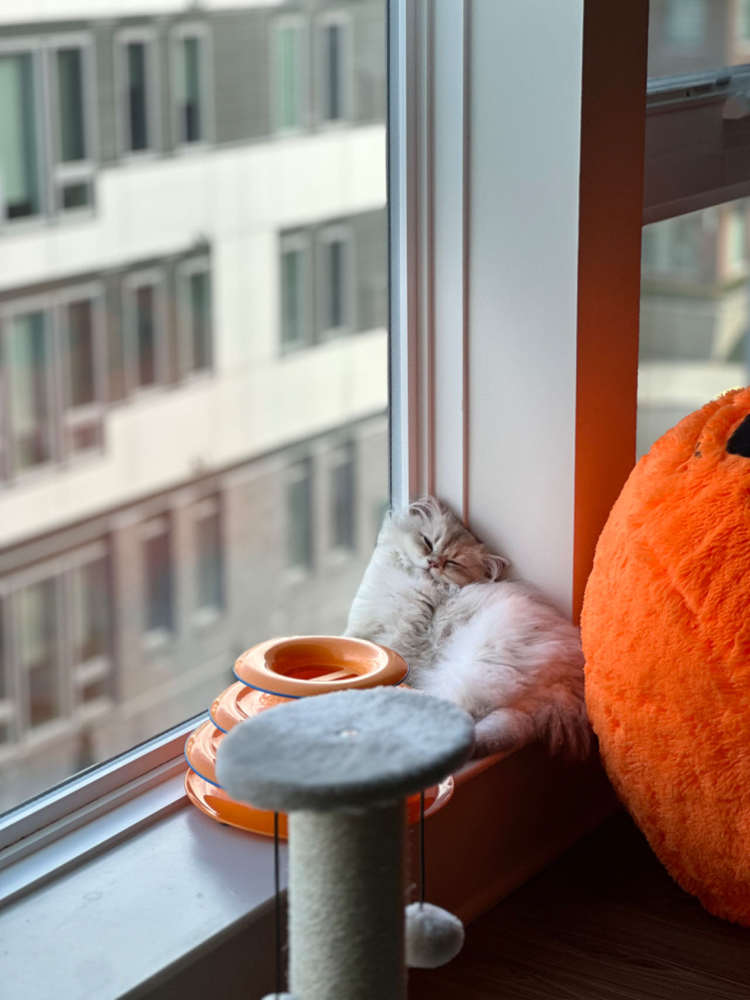

### Hi there 👋

- 🤔 I'm a graduate student in CMU Master of Computational Data Science Program.
- 🔭 I’m currently working on vector search and database internal.
- 🌱 I’m currently learning Rust and postgreSQL internal.
- 👯 I’m looking to collaborate on programs related to database or vector search.
- 📫 How to reach me: haoyuq@cs.cmu.edu/averyqi115@gmail.com
- ⚡ Fun fact:
  - Really into Frisbee🥏
  - I have the cutest kitten in the world.

